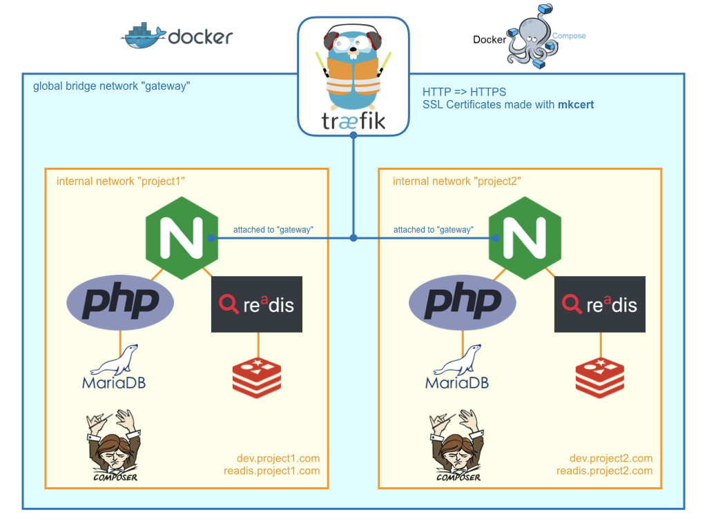

# Example projects for reverse-proxy routing with traefik

Two example web development projects connected to a traefik reverse proxy

This repository refers to my blog post: https://hollo.me/devops/routing-to-multiple-docker-compose-development-setups-with-traefik.html

